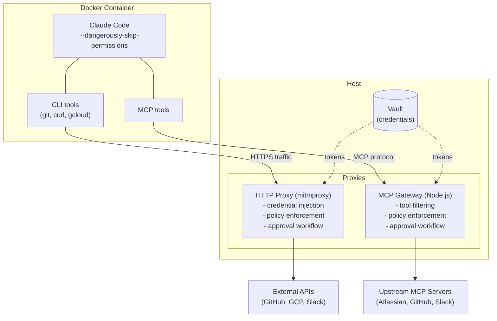

# Agent Sandbox

Secure execution environment for running [Claude Code](https://docs.anthropic.com/en/docs/claude-code) autonomously in Docker containers with credential isolation, policy enforcement, and approval workflows.

## What it does

- Runs Claude Code with `--dangerously-skip-permissions` inside a Docker container
- Proxies HTTP traffic through [mitmproxy](https://mitmproxy.org/) with per-domain credential injection and approval for write operations
- Proxies MCP tool calls through a TypeScript gateway with per-tool policy enforcement
- Protects the host via iptables firewall (blocks access to host services and local network)
- Persists agent sessions and Claude Code updates between runs

## Architecture



## Prerequisites

- Docker
- Python 3.11+
- Node.js 20+
- [mitmproxy](https://mitmproxy.org/) (`pip install mitmproxy`)
- [socat](https://linux.die.net/man/1/socat) (`brew install socat` on macOS)

## Quick Start

### 1. Clone and install

```bash
git clone https://github.com/gastonsalgado/agent-sandbox.git
cd agent-sandbox

# HTTP Proxy dependencies
cd http_proxy
python3 -m venv .venv
source .venv/bin/activate
pip install -e ".[dev]"
cd ..

# MCP Gateway dependencies
cd mcp_gateway
npm install
npm run build
cd ..
```

### 2. Generate mitmproxy CA certificate

```bash
mitmdump -p 0 &
sleep 2; kill %1
cp ~/.mitmproxy/mitmproxy-ca-cert.pem container/mitmproxy-ca-cert.pem
```

### 3. Build the container image

```bash
docker build -t sandbox-agent -f container/Dockerfile container/
```

### 4. Set up credentials

```bash
# Create vault for your client
mkdir -p vault/my-client

# GitHub (from gh CLI)
gh auth token > vault/my-client/github_token

# GCP (access token, expires ~1h)
gcloud auth print-access-token > vault/my-client/gcp_access_token

chmod 600 vault/my-client/*
```

### 5. Create client configuration

```bash
cp -r config/example config/my-client
# Edit config/my-client/http_policy.yaml  (HTTP proxy rules)
# Edit config/my-client/mcp_policy.yaml   (MCP gateway rules)
# Edit config/my-client/CLAUDE.md         (agent instructions)
```

### 6. Start the services

You need 3 terminals:

**Terminal 1 - HTTP Proxy:**
```bash
cd http_proxy && source .venv/bin/activate
CLIENT_ID=my-client \
VAULT_DIR=../vault \
HTTP_POLICY=../config/my-client/http_policy.yaml \
AUDIT_LOG=../logs/audit.jsonl \
mitmdump -s addon.py -p 3128 --set confdir=~/.mitmproxy
```

**Terminal 2 - MCP Gateway:**
```bash
cd mcp_gateway
CLIENT_ID=my-client \
VAULT_DIR=../vault \
MCP_POLICY=../config/my-client/mcp_policy.yaml \
GATEWAY_PORT=3129 \
npm start
```

**Terminal 3 - Sandbox:**
```bash
./launch.sh my-client /path/to/workspace
```

On first run, Claude Code will ask you to log in (`/login`). Credentials persist in `clients/my-client/` for subsequent runs.

## Configuration

### HTTP Policy (`http_policy.yaml`)

Controls CLI/HTTPS traffic. Per-domain rules with credential injection:

```yaml
rules:
  # Reads - allowed, credentials injected
  - match: {domain_contains: "github.com", method: GET}
    action: allow
    label: github read

  # Writes - need operator approval
  - match: {domain_contains: "github.com", path_contains: "git-receive-pack"}
    action: approval
    label: git push

  # Sensitive services - always need approval
  - match: {domain: "secretmanager.googleapis.com"}
    action: approval
    label: gcp secret manager

  # Default deny for credentialed domains
  - match: {domain_contains: "github.com"}
    action: deny
    label: github blocked

  # Everything else - free internet access
  - match: {domain: "*"}
    action: allow
    label: passthrough
```

### MCP Policy (`mcp_policy.yaml`)

Controls MCP tool calls. Defines upstream servers and per-tool rules:

```yaml
upstreams:
  atlassian:
    type: http
    url: "https://mcp.atlassian.com/v1/mcp"
    auth:
      source: oauth

  github:
    type: http
    url: "https://api.githubcopilot.com/mcp/"
    auth:
      source: vault
      token_key: github_token

rules:
  - match: {tool_contains: "get"}
    action: allow
  - match: {tool_contains: "create"}
    action: approval
    label: create operation
  - match: {tool: "*"}
    action: deny
    label: unknown tool
```

### Policy Actions

| Action | Behavior |
|--------|----------|
| `allow` | Pass through, inject credentials |
| `approval` | Prompt operator: `[y] Approve [g] Grant 5min [n] Deny` |
| `deny` | Block with error |

### Match Fields

| Field | Used in | Description |
|-------|---------|-------------|
| `domain` | HTTP | Exact domain match |
| `domain_contains` | HTTP | Substring match |
| `method` | HTTP | HTTP method (GET, POST, etc.) |
| `path_contains` | HTTP | URL path substring |
| `tool` | MCP | Exact tool name |
| `tool_contains` | MCP | Tool name substring |
| `*` | Both | Wildcard (matches anything) |

## Security Model

| Threat | Mitigation |
|--------|-----------|
| Credential theft | No credentials in container. Vault on host only. Proxy injects at request time. |
| Host access | iptables blocks all host ports except proxy. LAN blocked. |
| Destructive operations | Default-deny for credentialed domains. Write operations require approval. |
| Resource exhaustion | CPU, memory, PID limits on container. |
| Runaway agent | Timeout wrapper (default 1h). |
| Firewall bypass | Sudo excludes iptables/ip commands. Agent cannot modify firewall rules. |
| Path traversal | Vault paths validated against root directory. |

## Project Structure

```
agent-sandbox/
+-- http_proxy/          # Python - mitmproxy addon
|   +-- shared/          #   policy engine, vault, approval, audit
|   +-- tests/           #   unit tests (46 tests)
|   +-- addon.py         #   mitmproxy request handler
|   +-- credentials.py   #   per-domain credential injection
|   +-- pyproject.toml
+-- mcp_gateway/         # TypeScript - MCP tool proxy
|   +-- src/
|   |   +-- index.ts     #   Express server, session management
|   |   +-- gateway.ts   #   MCP server with policy handlers
|   |   +-- upstream.ts  #   upstream MCP client connections
|   |   +-- policy.ts    #   policy engine (port from Python)
|   |   +-- approval.ts  #   terminal approval with grants
|   |   +-- audit.ts     #   JSONL audit logging
|   |   +-- oauth.ts     #   OAuth 2.0 PKCE flow
|   |   +-- config.ts    #   YAML config loading
|   +-- package.json
|   +-- tsconfig.json
+-- container/           # Docker image
|   +-- Dockerfile
|   +-- entrypoint.sh    #   firewall setup + user drop
|   +-- init-firewall.sh #   iptables rules
|   +-- mcp-relay.py     #   stdio-to-socket bridge
+-- config/              # Per-client configuration
|   +-- example/
|       +-- http_policy.yaml
|       +-- mcp_policy.yaml
|       +-- CLAUDE.md
+-- launch.sh            # Orchestrates container launch
+-- vault/               # Credentials (gitignored)
+-- clients/             # Persistent client state (gitignored)
```

## Environment Variables

| Variable | Default | Description |
|----------|---------|-------------|
| `CLIENT_ID` | `default` | Client identifier |
| `VAULT_DIR` | `./vault` | Path to credential vault |
| `PROXY_PORT` | `3128` | HTTP proxy port |
| `GATEWAY_PORT` | `3129` | MCP gateway port |
| `CPU_LIMIT` | `2` | Container CPU cores |
| `MEMORY_LIMIT` | `4g` | Container memory limit |
| `PIDS_LIMIT` | `256` | Container max processes |
| `TIMEOUT` | `3600` | Execution timeout (seconds) |
| `VERBOSE` | unset | Set to `1` for Claude `--verbose` |

## Audit Log

All policy decisions are logged to JSONL:

```bash
tail -f logs/audit.jsonl | jq .
```

Each entry: `{action, client_id, reason, fields, timestamp}`

## Tests

```bash
cd http_proxy
source .venv/bin/activate
pytest -v
```

## License

Apache License 2.0. See [LICENSE](LICENSE).
